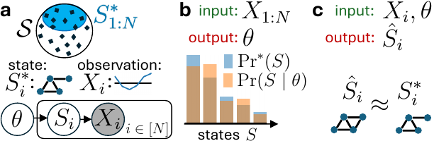
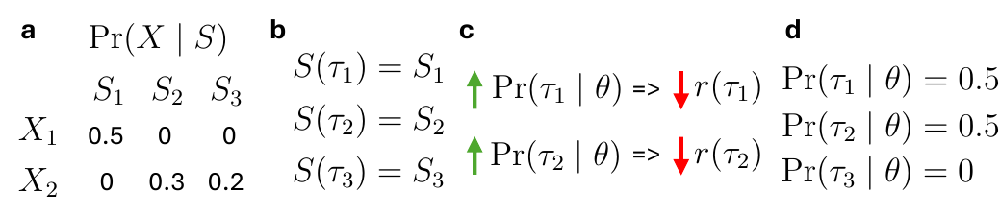

<!--
GReinSS tutorial — NCI Spring School on Algorithmic Cancer Biology
30-minute slot. Speaker notes are in HTML comments like this one.
Live-demo hand-offs are marked "→ NOTEBOOK".
-->

<style>
/* ===================== Theme: greinss ===================== */
:root {
  --ill-orange: #FF5F05;
  --ill-blue:   #13294B;
  --ink:        #1b1f24;
  --muted:      #5b6672;
  --bg:         #ffffff;
  --panel:      #f4f6f9;
  --accent:     #0b6cbf;
}
section {
  font-family: "Helvetica Neue", Arial, sans-serif;
  font-size: 26px;
  color: var(--ink);
  background: var(--bg);
  padding: 56px 64px;
  line-height: 1.4;
  /* anchor content (and the title) to the top so headings don't drift with content height */
  display: flex;
  flex-direction: column;
  justify-content: flex-start;
}
h1 { color: var(--ill-blue); font-size: 46px; margin: 0 0 12px 0; }
h2 { color: var(--ill-blue); font-size: 34px; margin: 0 0 18px 0;
     border-bottom: 3px solid var(--ill-orange); padding-bottom: 8px; }
h3 { color: var(--ill-orange); font-size: 26px; margin: 6px 0; }
strong { color: var(--ill-blue); }
a { color: var(--accent); }
em { color: var(--muted); font-style: italic; }
code { background: var(--panel); color: #b0330a; padding: 1px 6px; border-radius: 4px; font-size: 0.85em; }
ul, ol { margin: 6px 0; }
li { margin: 7px 0; }
section::after { color: var(--muted); font-size: 16px; }
blockquote {
  border-left: 5px solid var(--ill-orange);
  background: var(--panel);
  margin: 10px 0; padding: 12px 20px; color: var(--ink); font-style: normal;
}
.small { font-size: 20px; color: var(--muted); }
.tag { color: var(--ill-orange); font-weight: bold; letter-spacing: 0.5px; }
.center { text-align: center; }
table { font-size: 22px; margin: 8px auto; }
th { background: var(--ill-blue); color: #fff; padding: 8px 14px; }
td { padding: 7px 14px; border-bottom: 1px solid #dde3ea; }
.cols { display: grid; grid-template-columns: 1fr 1fr; gap: 34px; align-items: center; }
.cols3 { display: grid; grid-template-columns: 1fr 1fr 1fr; gap: 22px; align-items: start; }
.box { background: var(--panel); border-radius: 10px; padding: 14px 20px; }
.key { background: #fff4ee; border: 2px solid var(--ill-orange); border-radius: 10px; padding: 14px 20px; }
img { display: block; margin: 0 auto; }

/* Title / section-divider layouts — these two stay vertically centered on purpose */
section.title, section.divider { justify-content: center; }
section.title { background: linear-gradient(135deg, #13294B 0%, #0b6cbf 100%); color: #fff; }
section.title h1 { color: #fff; font-size: 52px; }
section.title h2 { color: #ffd9c7; border: none; font-size: 28px; }
section.title p, section.title strong { color: #eaf1f8; }
section.title strong { color: #fff; }
section.divider { background: var(--ill-blue); color: #fff; }
section.divider h1 { color: #fff; }
section.divider h2 { color: var(--ill-orange); border: none; }
section.divider p, section.divider li { color: #dbe4ef; }
section.demo { background: #fff4ee; }
section.demo h2 { color: var(--ill-orange); border-bottom-color: var(--ill-blue); }
</style>

<!-- _class: title -->
<!-- _paginate: false -->

# GReinSS

## Generative Modeling of Discrete Latent Structures via Dynamic Policy Gradients

<br>

**Stefan Ivanovic · Ge Liu · Mohammed El-Kebir**
University of Illinois Urbana-Champaign

<br>

<span class="small">NCI Spring School on Algorithmic Cancer Biology — Tutorial (30 min)</span>

<!--
Hi everyone. Today: a hands-on tutorial on GReinSS — a method for a problem that
shows up all over algorithmic cancer biology: inferring hidden combinatorial
states from noisy, indirect measurements. We'll cover the idea, the one theorem
that makes it work, and then train it live on your laptop.
Goal: you leave able to apply it to your own problem.
-->

---

## The recurring problem in computational biology

We rarely observe the biological state we care about. We observe **something generated from it**.

<div class="cols3">
<div class="box">

### Phylogenies
Tumor evolution trees
*(observed: noisy DNA-seq)*

</div>
<div class="box">

### CNV profiles
Copy-number states per cell
*(observed: read depth)*

</div>
<div class="box">

### RNA isoforms
Spliced transcripts
*(observed: short reads)*

</div>
</div>

<br>

> In each case we know the **forward model** $\Pr(X \mid S)$ — how a state $S$ produces data $X$ — but the state $S$ itself is **latent, discrete, and combinatorially large.**

<!--
The unifying pattern: a hidden discrete structure S, indirect observation X, and a
KNOWN or partially-known likelihood Pr(X|S). Trees, CNV sets, isoforms — all fit.
This is "self-supervised": the physics/biology of measurement is known; the state is not.
-->

---

## Two things we want

<div class="cols">
<div>

**Setup.** States $S^*_1,\dots,S^*_N \sim \Pr^*(S)$, unobserved.
We see indirect observations $X_1,\dots,X_N$, and can compute $\Pr(X\mid S)$.

We fit a generative model $\Pr(S\mid\theta)$ so that

$$\Pr(X\mid\theta)=\sum_{S}\Pr(X\mid S)\,\Pr(S\mid\theta)$$

</div>
<div>



</div>
</div>

<div class="cols">
<div class="key">

**① Learning.** Find $\theta$ maximizing the data likelihood
$\displaystyle\Pr(X_{1:N}\mid\theta)=\prod_i \Pr(X_i\mid\theta)$

</div>
<div class="key">

**② Inference.** For each $X_i$, recover
$\hat S_i=\arg\max_S \Pr(X_i\mid S)\,\Pr(S\mid\theta)$

</div>
</div>

<!--
Panel a: hidden distribution over states S*, each emits an X. We model Pr(S|θ).
Two problems: (1) LEARN θ from all observations jointly — the shared model couples
them; (2) INFER the best state per observation. Everything today serves these two.
-->

---

## Why the usual tools struggle

| Approach | Problem |
|---|---|
| **Expectation–Maximization** | E-step expectation over $\mathcal S$ is **intractable** when $\mathcal S$ is combinatorial |
| **Variational autoencoders** | learn *artificial* continuous latents — **not** the mechanistic $S$ you want |
| **Local search** ($\arg\max_S \Pr(X_i\mid S)$) | ignores the **shared** model $\Pr(S\mid\theta)$ across observations |
| **Naive policy gradient** | collapses to the single **highest-reward** state |
| **GFlowNets** | need **known terminal rewards**, not a likelihood to maximize |

<br>

> **Gap:** none of these directly maximize $\Pr(X_{1:N}\mid\theta)$ over a *discrete, combinatorial* state space.

<!--
EM: exact expectation needs summing over all states — only works for special structure (HMMs).
VAE: great generative models, but the latent lives in a made-up ℝ^d, not your isoform space.
Local search: per-observation, no sharing of statistical strength.
Naive PG / GFlowNet are the closest cousins to what we do — and we'll see exactly why they fail.
-->

---

<!-- _class: divider -->

# The GReinSS idea

## Build the discrete state step by step with a **policy**, and reward trajectories by their **share** of each observation's likelihood.

<span class="small">Generative Reinforcement Learning of Structured States</span>

---

## Generate states as trajectories

A **policy** with parameters $\theta$ builds a state by a sequence of actions — a **trajectory** $\tau$ ending in a terminal state $S(\tau)\in\mathcal S$.

<div class="cols">
<div>

- add an **edge** → a graph
- add an **element** → a set
- add a **junction** → an isoform

Sequential construction makes *combinatorial* spaces tractable: no summation over $\mathcal S$, just **sampling** trajectories.

</div>
<div class="box">

$$\Pr(X\mid\theta)=\mathbb{E}_{\tau\sim\Pr(\tau\mid\theta)}\big[\Pr(X\mid S(\tau))\big]$$

<span class="small">Estimate by sampling $M$ trajectories:</span>

$$\Pr(X_i\mid\theta)\approx\tfrac1M\textstyle\sum_j \Pr(X_i\mid\tau_j)$$

</div>
</div>

<!--
This is the RL move: represent a big discrete object as a path of small decisions.
The policy is a neural net that at each step picks the next action. Any structure you
can grow incrementally fits. We never enumerate S — we sample trajectories and average.
-->

---

## The one equation that matters

Train with a policy gradient — but with a **dynamically rescaled reward**:

<div class="key center">

$$r(\tau)=\sum_{i=1}^{N}\frac{\Pr(X_i\mid\tau)}{\Pr(X_i\mid\theta)}$$

</div>

<br>

**Theorem.** The policy gradient $\;\mathbb{E}_\tau\!\big[r(\tau)\,\tfrac{d}{d\theta}\log\Pr(\tau\mid\theta)\big]\;$ is an **unbiased estimator** of $\;\dfrac{d}{d\theta}\log\Pr(X_{1:N}\mid\theta).$

> So standard policy-gradient ascent with this reward = **maximum-likelihood** learning of $\Pr(S\mid\theta)$.

<!--
This is the whole method in one line. The numerator Pr(Xi|τ) is the usual "how well does
this trajectory explain observation i". The DENOMINATOR Pr(Xi|θ) is the current model's
total probability of that observation — it rescales each observation's contribution.
Gradient is taken ONLY through log Pr(τ|θ); the reward is treated as a constant each step,
then recomputed after the update. That's the "dynamic" part.
-->

---

## Why the denominator? (intuition)

The rescaling rewards a trajectory for its **proportional contribution** to $\Pr(X_i\mid\theta)$ — not its raw probability. This makes the policy **spread** over the states the data needs, instead of collapsing to one.

<div class="cols">
<div>



</div>
<div>

**Toy:** 3 states, 2 observations.
$\Pr(X_1|S_1)=.5,\ \Pr(X_2|S_2)=.3,\ \Pr(X_2|S_3)=.2$

**Naive PG** → chases the max reward ($\tau_1$):
$\Pr(\tau_1)=1 \Rightarrow \Pr(X_2\mid\theta)=0$
$\Rightarrow \Pr(X_{1:N}\mid\theta)=\mathbf 0$ ❌

**GReinSS** → rewards balance out:
$\Pr(\tau_1)=\Pr(\tau_2)=0.5,\ \Pr(\tau_3)=0$
$\Rightarrow \Pr(X_{1:N}\mid\theta)=0.0375$ ✓ *(optimal)*

</div>
</div>

<!--
Key teaching moment. Without rescaling, τ1 has the highest raw reward, so naive PG puts
ALL mass on it — but then X2 has zero probability and the joint likelihood is ZERO.
With the denominator, as soon as τ1 gets probability its reward drops (it's dividing by its
own success), so the policy is pushed to also cover X2. Equilibrium = the likelihood optimum.
Note τ3 dies: it's dominated by τ2 for explaining X2. The method finds the RIGHT support.
-->

---

## The training loop

<div class="cols">
<div>

**Repeat until convergence:**

1. **Sample** trajectories $\tau\sim\Pr(\tau\mid\theta)$
2. **Score** each with $\Pr(X_i\mid\tau)$
3. **Rewards** $r(\tau)=\sum_i \Pr(X_i\mid\tau)/\Pr(X_i\mid\theta)$
4. **Policy-gradient step** on $\theta$
5. **Recompute** $\Pr(X_i\mid\theta)$ → new rewards

</div>
<div class="box">

**You provide only two things:**

- a way to **generate** $S$ (grow it action-by-action)
- the likelihood **$\Pr(X\mid S)$**

Everything else is generic.

<br>

<span class="small">Mini-batching over observations keeps it unbiased and scalable (Thm.).</span>

</div>
</div>

<!--
Emphasize the API surface: the user supplies (a) a generator and (b) Pr(X|S). That's it.
The reward machinery, sampling, and gradient are provided. This is exactly what the
notebook will show — you'll write those two functions and call train().
-->

---

## Off-policy learning (when on-policy is too slow)

If sampling $\Pr(\tau\mid\theta)$ rarely produces states that explain any $X_i$, learning stalls.

**Sample where the data says to look** — bias toward the Bayes posterior:

$$q(\tau\mid X_{1:N},\theta)=\tfrac1N\sum_{i}\Pr(\tau\mid X_i,\theta),\qquad \Pr(\tau\mid X_i,\theta)=\frac{\Pr(X_i\mid\tau)\Pr(\tau\mid\theta)}{\Pr(X_i\mid\theta)}$$

> This proposal is the **unbiased, variance-minimizing** one (Thm.); importance sampling keeps the gradient correct. *In cancer apps, a cheap heuristic (e.g. CNNaive in CNRein) seeds plausible states.*

<!--
Practical must-have for hard problems. Instead of blindly sampling from the policy, we
tilt sampling toward states that actually fit each observation — provably the best proposal.
In our biology applications this is where domain knowledge enters: a fast classical method
proposes candidate states, and GReinSS refines the distribution over them.
Keep this slide brief unless the audience asks.
-->

---

<!-- _class: demo -->

## → NOTEBOOK · Demo 1: Set reconstruction

Recover binary **sets** from noisy real-valued measurements. *Trains live in ~10 s.*

<div class="cols">
<div>

**Problem.** $S^*_i\subseteq\mathcal U$, observe
$X_{i,j}\sim\mathcal N(1,\sigma^2)$ if $j\in S^*_i$, else $\mathcal N(0,\sigma^2)$.

**You'll write:**
```python
def log_pr_x_given_g(state, obs):
    return -0.5*np.sum((obs-state)**2)/sigma**2
```
…then `simpleTrainModel(...)`.

</div>
<div>

**Watch for:**
- median $\log\Pr(X_i\mid\theta)$ climbing to ~0
- recovered sets vs. thresholding the noise
- where the **shared model fixes** noisy bits

</div>
</div>

<!--
SWITCH TO JUPYTER. Walk through: load observations → define Pr(X|S) (one line) →
build generator net → train ~200 epochs live (watch the likelihood curve rise) →
infer states → compare to naive thresholding. The punchline: GReinSS denoises using
structure shared across observations, beating per-pixel rounding.
-->

---

## Results — simulations

<div class="cols">
<div class="center">

**Latent graphs** from random-walk endpoints

<span class="small">$k=10$ walks: GReinSS $F_1=\mathbf{0.891}$; all baselines $<0.55$</span>

</div>
<div class="center">

**Latent sets** from noisy measurements

<span class="small">$|\mathcal U|=1000$: GReinSS $F_1=\mathbf{0.938}$; GEM baselines $<0.4$</span>

</div>
</div>

> Dynamic rewards are a **small** code change over naive PG — but decisive. Naive PG here predicts the **empty graph** ($F_1=0$).

<!--
Two combinatorial state types, same method. Left: graphs — GReinSS dominates especially
when observations are information-poor (few walks). Right: sets — GReinSS is the only method
that scales to large universes. GEM-based methods (VAE/autoregressive/diffusion) plateau;
the closest RL cousins (naive PG, GFlowNet) fail. The reward rescaling is the difference.
-->

---

<!-- _class: demo -->

## → NOTEBOOK · Demo 2: Graph inference (pre-trained)

Latent **directed graphs** from start/end points of $k$ absorbing random walks.

<div class="cols">
<div>

**State** = 90 possible directed edges (10 nodes).
**$\Pr(X\mid S)$** from the shifted-Laplacian $(L+I)^{-1}$ random-walk model.

We **load a pre-trained policy**, run inference, and score edge-recovery $F_1$ against ground-truth graphs.

</div>
<div>

**Watch for:**
- training likelihood curve (pre-computed)
- a reconstructed graph $\hat S_i$ vs. true $S^*_i$
- per-graph $F_1$ distribution

</div>
</div>

<!--
SWITCH TO JUPYTER (second section). Heavier model, so we ship a pre-trained checkpoint.
Show: load model → simpleInference → compare predicted adjacency to the ground-truth graph
we saved during pre-training → report F1 and visualize one graph. This mirrors the paper's
Fig on graph inference but on your own generated instance with known truth.
-->

---

## Application — RNA isoforms beat RSEM

<div class="cols">
<div>


</div>
<div>

**State** $S$ = an isoform (chosen exon junctions) + sample + read position.
**$\Pr(X\mid S)=1$** iff read position & sample match — trivial forward model.

On **GTEx** (61 samples w/ matched long reads, 14,390 genes):

- GReinSS **beats RSEM by ≥0.05** on **46.6%** of genes; RSEM beats GReinSS on only **9.4%**
- *MBD2* example: GReinSS error **0.007** vs RSEM **0.537**

</div>
</div>

<!--
The payoff for this audience. Isoform quantification is a textbook latent-variable problem:
short reads are indirect observations of full-length transcripts. RSEM is the standard
EM tool GTEx ships. Dropping GReinSS in — with a trivial Pr(X|S) — matches long-read
ground truth far better. Panel c: on MBD2, GReinSS recovers the two true isoforms with
near-correct proportions; RSEM splits mass across wrong isoforms. Panel d: distribution
of (GReinSS - RSEM) error is shifted negative → GReinSS wins across the genome.
-->

---

## GReinSS already powers two cancer methods

<div class="cols">
<div class="box">

### CloMu
Tumor **phylogenies** of SNVs
*States:* mutation trees
*Observations:* noisy DNA-seq trees
<span class="small">Ivanovic & El-Kebir</span>

</div>
<div class="box">

### CNRein
**Copy-number** evolution in single cells
*States:* sets of CNV events per cell
*Observations:* single-cell DNA-seq
<span class="small">uses CNNaive for off-policy seeding</span>

</div>
</div>

<br>

> This paper **generalizes** the shared technique behind both into one framework for *any* discrete latent structure — with theory, off-policy theory, and baselines.

<!--
GReinSS isn't just a new paper method — it's the generalization of machinery that already
produced two cancer-genomics tools. If you work on trees, CNVs, isoforms, or any grow-able
discrete structure with a known likelihood, this framework likely applies to you.
-->

---

## When should *you* reach for GReinSS?

<div class="cols">
<div>

**Good fit ✓**
- latent state is **discrete / combinatorial**
- you can **generate** it incrementally
- you know (or can compute) **$\Pr(X\mid S)$**
- observations are **indirect** & shared structure exists

</div>
<div>

**Reach elsewhere ✗**
- continuous latents → VAE / diffusion
- tractable exact E-step → classic EM
- rewards truly fixed & known → standard RL / GFlowNet

</div>
</div>

<div class="key">

**Recipe:** ① write a generator for $S$ · ② write $\Pr(X\mid S)$ · ③ `simpleTrainModel` · ④ `simpleInference`. *(optional)* add an off-policy proposal for hard instances.

</div>

<!--
Decision guide. The two hard requirements: an incremental generator and a likelihood.
If you have those, the four-line recipe is all you need to start — exactly what the
notebook demonstrates.
-->

---

<!-- _class: title -->
<!-- _paginate: false -->

# Thank you — let's build

**Code + notebook:** `code/README.md`, `tutorial/GReinSS_demo.ipynb`
**Recipe:** generator for $S$ + likelihood $\Pr(X\mid S)$ → train → infer

<br>

<span class="small">Questions? · melkebir@illinois.edu</span>

<!--
Wrap up: the method is one reward formula with a clean theorem, it beats the standard
tools on simulations and on real isoform data, and it's a drop-in for discrete latent-state
problems in cancer genomics. Open the notebook and try it on your own Pr(X|S).
-->
