<!--
GReinSS tutorial — NCI Spring School on Algorithmic Cancer Biology
Speaker notes are in HTML comments like this one.
Live-demo hand-offs are marked "→ NOTEBOOK".
-->

<!-- _class: title -->
<!-- _paginate: false -->

<!-- Laser pointer: replace the mouse arrow with a red dot on every slide of the interactive deck (just preview / marp --html). No effect in the PDF/PNG exports (static images have no cursor). -->
<style>
section, section * {
  cursor: url('data:image/svg+xml,<svg xmlns="http://www.w3.org/2000/svg" width="32" height="32" viewBox="0 0 32 32"><defs><radialGradient id="g" cx="0.5" cy="0.5" r="0.5"><stop offset="0" stop-color="rgb(255,200,180)"/><stop offset="0.35" stop-color="rgb(255,45,25)"/><stop offset="0.7" stop-color="rgb(230,0,0)" stop-opacity="0.45"/><stop offset="1" stop-color="rgb(220,0,0)" stop-opacity="0"/></radialGradient><filter id="b"><feGaussianBlur stdDeviation="1.6"/></filter></defs><circle cx="16" cy="16" r="11" fill="rgb(255,25,10)" fill-opacity="0.5" filter="url(%23b)"/><circle cx="16" cy="16" r="6" fill="url(%23g)"/></svg>') 16 16, pointer;
}
</style>

# GReinSS

## Generative Modeling of Discrete Latent Structures via Dynamic Policy Gradients

<br>

**Mohammed El-Kebir**
University of Illinois Urbana-Champaign

<br>

<span class="small">NCI Spring School on Algorithmic Cancer Biology — Tutorial</span>

<span class="small">Ivanovic et al., ICML 2026</span>

<!--
Hi everyone. Today: a hands-on tutorial on GReinSS — a method for a problem that
shows up all over algorithmic cancer biology: inferring hidden combinatorial
states from noisy, indirect measurements. We'll cover the idea, the one theorem
that makes it work, and then train it live on your laptop.
Goal: you leave able to apply it to your own problem.
-->

---

## A recurring statistical inference problem in computational biology

<style scoped>
.setup { margin-bottom: 0; }
blockquote { margin: 24px 0; }
</style>

<div class="cols3 setup">
<div class="box center">

**States** $S_{1:N} \sim \Pr^*(\mathcal{S})$

<div class="sfig">

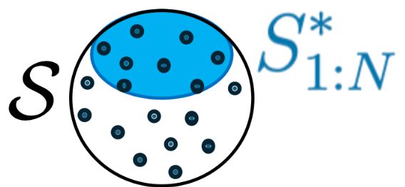

</div>

</div>
<div class="box center">

**Measurements** $X_{1:N}$ generated from $S_{1:N}$

<div class="sfig">

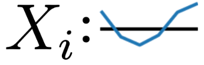

</div>

</div>
<div class="box center">

$\mathcal{S}$ is typically **large and combinatorial** — graphs, strings, sets, …

<div class="sfig">

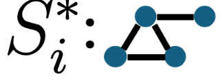

</div>

</div>
</div>

> Rather than directly observing the latent **state** $S$ we care about, we observe some indirect **measurement** $X$ generated from it.

<div class="cols3">
<div class="box center">

### Phylogenies

<div class="exfig">

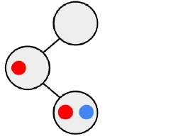

</div>

**State:** tumor evolution tree
**Measurement:** DNA-seq

<span class="cite">[Ivanovic & El-Kebir, RECOMB/Genome Res. 2023]</span>

</div>
<div class="box center">

### CNA profiles

<div class="exfig">

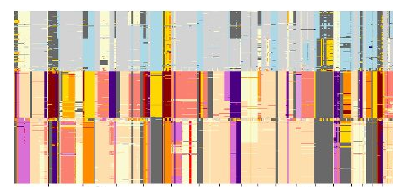

</div>

**State:** copy-number profile
**Measurement:** read depth + BAF

<span class="cite">[Ivanovic & El-Kebir, Genome Biol. 2025]</span>

</div>
<div class="box center">

### RNA isoforms

<div class="exfig">


</div>

**State:** spliced transcript
**Measurement:** aligned short reads

<span class="cite">[Ivanovic et al., ICML 2026]</span>

</div>
</div>

<!--
The unifying pattern: a hidden discrete structure S, indirect observation X, and a
KNOWN or partially-known likelihood Pr(X|S). Trees, CNA sets, isoforms — all fit.
This is "self-supervised": the physics/biology of measurement is known; the state is not.
-->

---

## A learning and an inference problem

<div class="cols3 setup">
<div class="box center">

**Approximate** $\Pr^*(S)$ as $\Pr(S\mid\theta)$

<div class="s3fig">

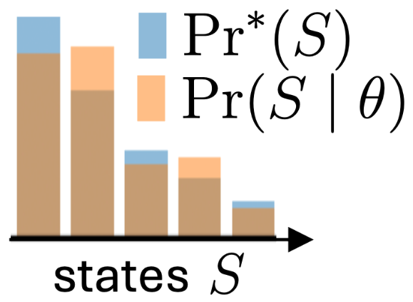

</div>

</div>
<div class="box center">

**Parameters** $\theta$: a linear map or neural network

<div class="s3fig">

<!-- include: assets/svg/theta-network.svg -->

</div>

</div>
<div class="box center">

**Generative model** with given $\Pr(X\mid S)$

<div class="platebox">

<!-- include: assets/svg/plate-generative.svg -->

<span class="emit"><span class="arw">&#8594;</span></span>

</div>

</div>
</div>

<div class="problem">

**Problem 1 (Learning).** *Given (i) $X_{1:N}$ and (ii) $\Pr(X\mid S)$, find $\theta$ maximizing ${\Pr(X_{1:N}\mid\theta)=\prod_i \Pr(X_i\mid\theta})$, where $\Pr(X_i\mid\theta)=\sum_{S}\Pr(X_i\mid S)\,\Pr(S\mid\theta)$*

</div>

<div class="problem">

**Problem 2 (Inference).** *Given (i) $X_{1:N}$, (ii) $\Pr(X\mid S)$, and (iii) $\theta$, find $\hat{S}_{1:N}$, where ${\hat S_i=\arg\max_S \Pr(X_i\mid S)\,\Pr(S\mid\theta)}$*

</div>

<!--
Panel a: hidden distribution over states S*, each emits an X. We model Pr(S|θ).
Two problems: (1) LEARN θ from all observations jointly — the shared model couples
them; (2) INFER the best state per observation. Everything today serves these two.
-->

---

## Why the usual tools struggle

<style scoped>
table { table-layout: fixed; width: 1148px; font-size: 22px; border-collapse: collapse; margin: 16px auto 0; }
th, td { box-sizing: border-box; }
th:nth-child(1), td:nth-child(1) { width: 168px; }
th:nth-child(2), td:nth-child(2) { width: 300px; }
th:nth-child(3), td:nth-child(3) { width: 680px; }
td.fam { background: var(--panel); color: var(--ill-blue); font-weight: 700; text-align: center; vertical-align: middle; font-size: 21px; }
tbody tr.grp td { border-top: 3px solid #b9c3d1; }
td.m { font-weight: 700; color: var(--ill-blue); vertical-align: middle; }
td.d { vertical-align: middle; }
blockquote { margin-top: 24px; }
</style>

<table>
<thead>
<tr><th>Family</th><th>Method</th><th>Why it struggles</th></tr>
</thead>
<tbody>
<tr class="grp"><td class="fam">Exact<br>inference</td><td class="m">Expectation–Maximization</td><td class="d">E-step exact only for <strong>special structure</strong> (e.g. <strong>HMMs</strong>) — <strong>intractable</strong> for a combinatorial state space</td></tr>
<tr class="grp"><td class="fam" rowspan="2">Variational</td><td class="m">Variational inference</td><td class="d">maximizes an <em>ELBO</em> bound, not the likelihood — needs a <strong>tractable posterior</strong> over combinatorial states</td></tr>
<tr><td class="m">Variational autoencoders</td><td class="d">learn <em>artificial</em> continuous latents — <strong>not</strong> the mechanistic state you want</td></tr>
<tr class="grp"><td class="fam">Search</td><td class="m">Local search</td><td class="d">ignores the <strong>shared</strong> model across observations</td></tr>
<tr class="grp"><td class="fam" rowspan="2">Reinforcement<br>learning</td><td class="m">Naive policy gradient</td><td class="d">collapses to the single <strong>highest-reward</strong> state</td></tr>
<tr><td class="m">GFlowNets</td><td class="d">aim to <strong>sample in proportion to a fixed reward</strong> — not to maximize a likelihood</td></tr>
</tbody>
</table>

> **Gap:** none of these directly maximize $\Pr(X_{1:N}\mid\theta)$ over a *discrete, combinatorial* state space.

<!--
Grouped into four families so each method fits a bucket: exact inference, variational, search, RL.
EXACT / EM: the E-step needs an exact expectation over all states — tractable ONLY for special
structure like an HMM chain (forward–backward); it blows up the moment S is combinatorial. HMMs
are the poster child for "where these tools work" — GReinSS is for everything past that.
VARIATIONAL — VI: optimizes a lower bound (ELBO) instead of the true likelihood, and you must
hand-design a tractable approximate posterior q(S) over a combinatorial space — exactly what's hard.
VAE: great generative models, but the latent lives in a made-up ℝ^d, not your isoform space.
SEARCH — local search: per-observation, no sharing of statistical strength across observations.
RL — naive PG / GFlowNet are the closest cousins to what we do — and we'll see exactly why they fail.
Punchline: all four families miss the SAME target — directly maximizing the joint data likelihood.
-->

---

## Primer on reinforcement learning (RL) — fixed rewards

> **Key question:** What actions should an agent take to maximize a reward signal? 

<style scoped>
.cols { grid-template-columns: 2.15fr 1fr; margin: 26px 0; }
blockquote { margin-bottom: 6px; }
.key { margin-top: 6px; }
table { table-layout: fixed; width: 435px; margin: 0; font-size: 20px; }
th, td { box-sizing: border-box; }
th:nth-child(1), td:nth-child(1) { width: 150px; }
th:nth-child(2), td:nth-child(2) { width: 285px; }
</style>

<div class="cols">
<div style="display: flex; align-items: center; gap: 14px;">

| Concept | In RL |
|---|---|
| **State** $s_t$ | current situation |
| **Action** $a_t$ | transitions $s_t\to s_{t+1}$ |
| **Policy** $\pi_\theta$ | picks the next action |
| **Trajectory** $\tau$ | path $s_0\to\cdots\to s_{\lvert\tau\rvert}$ |
| **Reward** $r(\tau)$ | scores terminal state |
| **Objective** | $\max_\theta \mathbb{E}_\tau[r(\tau)]$ |

<div style="flex: 1; text-align: center;">

<!-- include: assets/svg/rl-loop.svg -->

</div>

</div>
<div class="center">

<!-- include: assets/svg/rl-trajectory.svg -->

<div class="small" style="margin-top: 2px;">a trajectory &#964;</div>

</div>
</div>

<div class="key">

**Policy gradient (REINFORCE):** $\;\nabla_\theta\,\mathbb{E}_{\tau\sim\Pr(\tau\mid\theta)}[r(\tau)]=\mathbb{E}_\tau\big[r(\tau)\,\nabla_\theta\log\Pr(\tau\mid\theta)\big]$ — *gradient through $\log\Pr(\tau\mid\theta)$ only, not the fixed reward $r(\tau)$.*

</div>

<!--
The generic RL mental model, deliberately provider-neutral and episodic:
the policy builds an object action-by-action (a trajectory), a scalar reward scores
the finished trajectory, and the goal is to maximize EXPECTED reward. Trace the three
arrows aloud: sample τ from the policy → score it → policy-gradient nudge, then repeat.
The one identity they must take away is REINFORCE: you can differentiate an expectation
over samples by weighting each trajectory's log-prob gradient by its reward — no gradient
through the reward itself. Everything on the next two content slides is this loop with a
specific reward plugged in. Contrast up top with supervised learning to anchor the audience.
-->

---

## GReinSS: <u>G</u>enerative <u>Rein</u>forcement Learning of <u>S</u>tructured <u>S</u>tates

> **Policy gradient (REINFORCE):** $\;\nabla_\theta\,\mathbb{E}_{\tau\sim\Pr(\tau\mid\theta)}[r(\tau)]=\mathbb{E}_\tau\big[r(\tau)\,\nabla_\theta\log\Pr(\tau\mid\theta)\big]$

<!--> **Key question:** Can we adapt reward function $r(\tau)$ to optimize data likelihood $\Pr(X_{1:N}\mid \theta)$?-->

<style scoped>
.cols { grid-template-columns: 700px 1fr; margin: 26px 0; }
blockquote { margin-bottom: 6px; }
.key { margin-top: 6px; }
table { table-layout: fixed; width: 685px; margin: 0; font-size: 20px; }
th, td { box-sizing: border-box; padding: 7px 8px; }
th:nth-child(1), td:nth-child(1) { width: 150px; }
th:nth-child(2), td:nth-child(2) { width: 285px; }
th:nth-child(3), td:nth-child(3) { width: 250px; }
</style>

<div class="cols">
<div>

| Concept | In RL | In GReinSS |
|---|---|---|
| **State** $s_t$ | current situation | <span style="color:#8a94a0;font-style:italic">same as RL</span> |
| **Action** $a_t$ | transitions $s_t\to s_{t+1}$ | <span style="color:#8a94a0;font-style:italic">same as RL</span> |
| **Policy** $\pi_\theta$ | picks the next action | <span style="color:#8a94a0;font-style:italic">same as RL</span> |
| **Trajectory** $\tau$ | path $s_0\to\cdots\to s_{\lvert\tau\rvert}$ | <span style="color:#8a94a0;font-style:italic">same, terminal $S(\tau)$</span> |
| **Reward** $r(\tau)$ | scores terminal state | <span style="color:#c0341a;font-weight:600">use $\Pr(X\mid S)$???</span> |
| **Objective** |  $\max_\theta \mathbb{E}_\tau[r(\tau)]$ | <span style="color:#c0341a;font-weight:600">$\max_\theta \log\Pr(X_{1:N}\mid\theta)$</span> |

</div>
<div class="center">

<div style="display: flex; align-items: center; justify-content: center; gap: 12px;">

<!-- include: assets/svg/graph-buildup.svg -->

<!-- include: assets/svg/cna-example.svg -->

</div>
</div>
</div>

<div class="key">

**Key question:** How to set rewards $r(\tau)$ such that ${\nabla_\theta\,\mathbb{E}_{\tau\sim\Pr(\tau\mid\theta)}[r(\tau)]=\mathbb{E}_\tau\big[r(\tau)\,\nabla_\theta\log\Pr(\tau\mid\theta)\big] = \nabla_\theta \log \Pr(X_{1:N} \mid \theta)}$?

</div>

<!--
Same diagram, re-labeled — say it out loud: "nothing about the machinery changes."
Actions grow a discrete structure; the trajectory's terminal state IS the object we care
about S(τ); the policy is a neural net; the reward (orange, highlighted) is the only novel
piece and the objective is now the data log-likelihood, not a hand-picked reward. This is
the pivot: GReinSS = policy gradient where the reward is engineered so that maximizing
expected reward provably equals maximum-likelihood learning. Hold the suspense on the exact
reward formula — that's the very next slide (the denominator is the whole trick).
-->

---

## Dynamic rewards

> Train with a policy gradient using the **dynamically rescaled reward** ${r(\tau)=\sum_{i=1}^{N}\Pr(X_i\mid\tau)/\Pr(X_i\mid\theta)}$

<style scoped>
.eqsplit { justify-content: center; gap: 22px; margin: 30px 0; }
</style>

<div class="eqsplit">
<div class="eqbox gbox">

$$\nabla_\theta\underbrace{\log\Pr(X_{1:N}\mid\theta)}_{\text{log-likelihood}}$$

<span class="lbl">what we optimize</span>

</div>
<div class="eq">=</div>
<div class="eqbox rbox">

$$\underbrace{\mathbb{E}_\tau\!\Big[r(\tau)\,\nabla_\theta\log\Pr(\tau\mid\theta)\Big]}_{\text{policy gradient}}$$

<span class="lbl">how we optimize it</span>

</div>
</div>

<div class="theorem">

**Theorem 1 (Unbiased policy gradient).** *With the dynamically changing reward $r(\tau)=\sum_{i=1}^{N}\Pr(X_i\mid\tau)/\Pr(X_i\mid\theta)$, the policy gradient $\mathbb{E}_\tau\!\big[r(\tau)\,\nabla_\theta\log\Pr(\tau\mid\theta)\big]$ is an unbiased estimator of $\nabla_\theta\log\Pr(X_{1:N}\mid\theta)$.*

</div>

<!--
The method in one line: what we optimize (the log-likelihood gradient) equals how we optimize
it (a policy gradient with the dynamically rescaled reward). The numerator Pr(Xi|τ) is "how
well does this trajectory explain observation i"; the DENOMINATOR Pr(Xi|θ) is the model's total
probability of Xi, which rescales each observation's contribution. Theorem 1: this policy
gradient is unbiased for the log-likelihood gradient — gradient taken ONLY through log Pr(τ|θ),
the reward treated as constant each step.
-->

---

## Intuition behind dynamic rewards — why the denominator $\Pr(X_i\mid \theta)$?

<style scoped>
.setup { display: grid; grid-template-columns: auto 1fr; align-items: center; gap: 22px; margin: 2px 0 6px; }
.setup table { margin: 0; font-size: 22px; border-collapse: collapse; }
.setup td, .setup th { border: 1px solid #d0d7e0; padding: 9px 14px; text-align: center; }
.setup th { background: #13294B; color: #fff; }
.tcap { display: block; text-align: center; font-size: 17px; color: #5b6672; margin-bottom: 3px; }
.cols { align-items: stretch; gap: 34px; margin: 2px 0; }
.panel { padding: 6px 14px 8px; border-radius: 12px; border: 2px solid; }
.panel.bad { background: #fdecea; border-color: #e0a99f; }
.panel.good { background: #eaf6ec; border-color: #a9d5b4; }
.chip { text-align: center; font-size: 19px; padding: 4px 10px; border-radius: 8px; margin-top: 6px; }
.chip.bad { background: #f6cec7; color: #a82c15; border: 1px solid #dd9e93; }
.chip.good { background: #c9e7cd; color: #1c6e2f; border: 1px solid #9ccfa6; }
.chip p { margin: 0; }
.rhead { font-size: 24px; font-weight: 700; margin-bottom: 6px; }
.rsub { display: block; font-size: 15px; color: #5b6672; margin-bottom: 2px; min-height: 20px; }
.rnote { font-size: 16px; margin-top: 2px; }
</style>

<div class="setup">
<div>

| $\Pr(X \mid S)$ | $S_1$ | $S_2$ | $S_3$ |
|---|:--:|:--:|:--:|
| $X_1$ | $.5$ | | |
| $X_2$ | | $.3$ | $.2$ |

</div>
<div>

**Example:** Two measurements $X_1$ and $X_2$. States $\mathcal{S} = \{S_1, S_2, S_3\}$. 

**Parameters:** $\theta \equiv (\Pr(S_1\mid\theta), \Pr(S_2\mid\theta), \Pr(S_3\mid\theta))$ 
<!--Policy $\theta\equiv\Pr(\tau\mid\theta)$ over $\tau_1,\tau_2,\tau_3$ ($\tau_j$ builds $S_j$); marginal $\Pr(X_i\mid\theta)=\sum_\tau\Pr(\tau\mid\theta)\,\Pr(X_i\mid\tau)$.-->

**Objective:** $\max_\theta \Pr(X_1, X_2 \mid \theta) = \max_\theta \mathbb{E}_\tau[r(\tau)]$

</div>
</div>


<div class="cols">
<div class="center panel bad">

<span class="rhead">Fixed rewards 
$r(\tau)=\Pr(X_i\mid\tau)$</span>

<!-- include: assets/svg/reward-fixed.svg -->

<div class="rnote">

$\theta^\star=(1,0,0)$:  $\Pr(X_1\mid\theta)=.5,\ \Pr(X_2\mid\theta)=0$

</div>

<div class="chip bad">

$\mathbb{E}_\tau[r]$ is linear in the policy ⇒ all mass on the best, $\tau_1$
$\Pr(X_1,X_2\mid\theta)=.5\times 0=\mathbf 0$ ✗

</div>

</div>
<div class="center panel good">

<span class="rhead">Dynamic rewards 
$r(\tau)=\Pr(X_i\mid\tau)/\Pr(X_i\mid\theta)$</span>

<!-- include: assets/svg/reward-dynamic.svg -->

<div class="rnote">

$\theta^\star=(.5,.5,0)$:  $\Pr(X_1\mid\theta)=.25,\ \Pr(X_2\mid\theta)=.15$

</div>

<div class="chip good">

$\max\mathbb{E}_\tau[r]=\max \Pr(X_1,X_2\mid\theta)$ ⇒ balances $\tau_1,\tau_2$
$\Pr(X_1,X_2\mid\theta)=.25\times.15=0.0375$ ✓

</div>

</div>
</div>

<!--> Reward **shrinks as it succeeds** ⇒ the policy covers *every* observation.-->

<!--
θ IS the policy: the bars plot Pr(τ|θ), and each panel is the DIFFERENT θ* that its reward
selects. The values are exact optima, not eyeballed. Assume one X1 and one X2.
LEFT (raw reward = Pr(Xi|τ)): per-trajectory reward (.5,.3,.2); maximizing E_τ[r] is linear in
the policy, so all mass goes to the top, τ1 → θ*=(1,0,0). Then Pr(X2|θ)=0 and the joint L=0.
RIGHT (rescaled): Thm 1 makes this maximize the data likelihood L = Pr(X1|θ)·Pr(X2|θ) =
(.5 p1)(.3 p2 + .2 p3). τ3 is dominated by τ2 for X2 (.2<.3) so p3=0; then L = .15 p1 p2 with
p1+p2=1, maximized at p1=p2=.5 → θ*=(.5,.5,0), L=.25×.15=.0375 (the global optimum).
Punchline: the denominator = automatic load-balancing across observations.
(This exact 3-state example is reproduced numerically in the notebook's FINAL section,
"Intuition — why the denominator matters" — mention it now, run it live at the recap if time.)
-->

---

## GReinSS training loop

<style scoped>
.cols { align-items: center; margin: 8px 0; }
.key { padding: 8px 20px; }
.key .katex-display { margin: 5px 0; }
ol { font-size: 21px; margin: 6px 0; }
ol li { margin: 5px 0; }
.box { padding: 10px 18px; }
</style>

<div class="cols" style="grid-template-columns: 1.8fr 1fr;">
<div class="key">

The **sample → score → update** cycle of RL, run with a reward that changes as $\theta$ learns:


$$r(\tau)=\sum_{i=1}^{N}\frac{\Pr(X_i\mid\tau)}{\boxed{\Pr(X_i\mid\theta)}}\qquad\Pr(X_i\mid\theta)=\mathbb{E}_{\tau}\big[\Pr(X_i\mid\tau)\big]$$

**Dynamic reward** — the boxed denominator is **re-estimated by sampling** each iteration.

</div>
<div class="center">

<!-- include: assets/svg/training-cycle.svg -->

</div>
</div>

<div class="cols" style="grid-template-columns: 1.35fr 1fr;">
<div>

**Repeat until convergence:**

1. **Sample** a batch $\tau_1,\dots,\tau_M\sim\Pr(\tau\mid\theta)$
2. **Score** each: $\Pr(X_i\mid\tau_j)$
3. **Estimate** $\Pr(X_i\mid\theta)\approx\frac1M\sum_j\Pr(X_i\mid\tau_j)$ &nbsp;<span class="small">*(same batch)*</span>
4. **Reward** $r(\tau_j)=\sum_i\Pr(X_i\mid\tau_j)/\Pr(X_i\mid\theta)$
5. **Policy-gradient** step along $\mathbb{E}_\tau\big[r(\tau)\,\nabla_\theta\log\Pr(\tau\mid\theta)\big]$

</div>
<div class="box">

**You supply only two things:**

- a **generator** for $S$ (action-by-action)
- the likelihood **$\Pr(X\mid S)$**

</div>
</div>

<!--
The training loop IS the RL cycle from the primer, with our reward plugged in: sample τ from
the policy → score with Pr(Xi|τ) → policy-gradient update θ. The one addition over vanilla RL
is on the loop-back leg: the denominator Pr(Xi|θ) shifts as θ learns, so each iteration we
re-estimate it by sampling (average Pr(Xi|τ) over sampled trajectories). As a state gets
covered its denominator grows and its reward shrinks — automatic load balancing.
API surface: the user supplies only (a) a generator for S and (b) the likelihood Pr(X|S).
Everything else — reward machinery, sampling, gradient — is provided. That's exactly what the
notebook will show: write those two functions and call train().
-->

---

<!-- _class: demo -->

## → NOTEBOOK · Demo 1: Set reconstruction

<style scoped>
.cols { align-items: start; margin: 12px 0 4px; }
.cartoon { margin: 2px auto 0; text-align: center; }
.cartoon svg { width: 830px; max-width: 100%; height: auto; }
.ccap { font-size: 18px; color: var(--muted); text-align: center; margin: 2px auto 0; max-width: 900px; }
.ccap b { color: var(--ill-blue); font-weight: 700; }
</style>

Recover binary **sets** from noisy real-valued measurements. *Trains live in ~10 s.*

<div class="cols">
<div>

**Problem.** $S^*_i\subseteq\mathcal U$, observe
$X_{i,j}\sim\mathcal N(1,\sigma^2)$ if $j\in S^*_i$, else $\mathcal N(0,\sigma^2)$.

**You'll write:**
```python
def log_pr_x_given_g(state, obs):
    return -0.5*np.sum((obs-state)**2)/sigma**2
```
…then `simpleTrainModel(...)`.

</div>
<div>

**Shared structure:** Each $S^*_i$ = a union of a few reusable **subsets**, so a shared $\Pr(S\mid\theta)$ pools across observations.

**Watch for:**
- median $\log\Pr(X_i\mid\theta)$ climbing to ~0
- recovered sets vs. thresholding the noise
- where the **shared model fixes** noisy bits

</div>
</div>

<div class="cartoon">
<!-- include: assets/svg/set-cartoon.svg -->
</div>

<div class="ccap">

<b><span style="color:#13294B">&#9679;</span> true set $S^*_i$</b> &nbsp; <b><span style="color:#cf2f1c">&#9679;</span> noisy observation $X_i$</b> &nbsp;—&nbsp; rounding at ½ flips the <span style="color:#FF5F05">&#9711;</span> circled elements.
</div>

<!--
SWITCH TO JUPYTER. Walk through: load observations → define Pr(X|S) (one line) →
build generator net → train ~200 epochs live (watch the likelihood curve rise) →
infer states → compare to naive thresholding. The punchline: GReinSS denoises using
structure shared across observations, beating per-pixel rounding.
-->

---

<!-- _class: demo -->

## → NOTEBOOK · Demo 2: Off-policy learning at scale

<style scoped>
.cols { align-items: start; gap: 30px; margin: 12px 0; }
.cols .theorem { margin: 10px 0; }
.cols .theorem .katex-display { margin: 4px 0; }
blockquote { margin: 10px 0 0; }
</style>

<div class="cols">
<div>

With a **larger, dispersed** state space: sampling $\Pr(\tau\mid\theta)$ rarely hits a terminal state $S(\tau)$ explaining any $X_i$, so most trajectories earn no reward and learning stalls.

<!--**Watch for:** on-policy median $F_1$ *below* thresholding · off-policy median $F_1=\mathbf{0.938}$ · the same sets recovered.-->


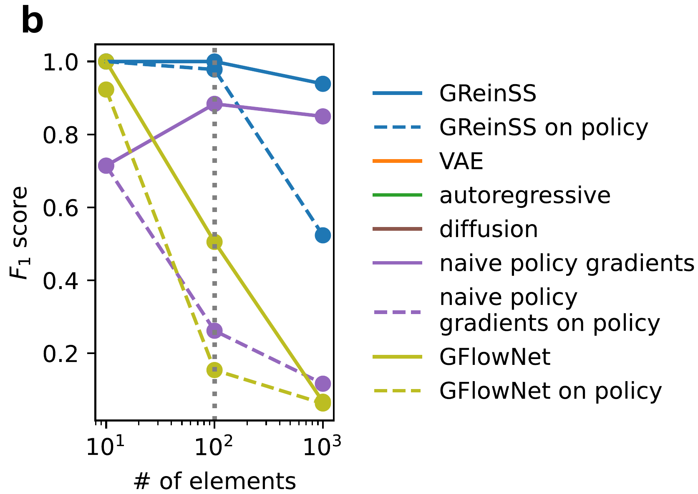


</div>
<div>

**Off-policy sampling:** If the policy rarely samples states explaining any $X_i$, learning stalls — **sample where the data says to look:**

<div class="theorem">

**Theorem 2 (Optimal off-policy proposal).** *The unbiased, variance-minimizing sampling proposal is $q^\star$:*

$$q^\star(\tau\mid X_{1:N},\theta)=\tfrac1N\textstyle\sum_{i=1}^{N}\Pr(\tau\mid X_i,\theta)$$

$$\Pr(\tau\mid X_i,\theta)=\frac{\Pr(X_i\mid\tau)\,\Pr(\tau\mid\theta)}{\Pr(X_i\mid\theta)}$$

</div>


</div>
</div>


> **$q^\star$ is intractable** → sample a tractable **$q\approx q^\star$** (for sets: favor element $j$ by $(X_{i,j}-\tfrac12)/\sigma^2$), then **reweight** by $\Pr(\tau\mid\theta)/q(\tau)$.

<!--
MERGED: the off-policy theorem and the Demo 2 handoff on one slide.
RIGHT — the concept: instead of blindly sampling the policy, tilt sampling toward states
that actually fit each observation (Theorem 2 = provably the best, variance-minimizing
proposal); importance sampling keeps the gradient unbiased. In our biology apps this is
where domain knowledge enters — a fast classical method (e.g. CNNaive in CNRein) proposes
candidate states and GReinSS refines the distribution over them.
LEFT — SWITCH TO JUPYTER (Demo 2): same set problem as Demo 1 but |U|=1000. Run the
unchanged on-policy recipe live and it scores WORSE than naive thresholding — sampling a
~180-of-1000 set by chance essentially never happens (needle in a haystack), so the gradient
sees no signal. Then flip on the observation-biased off-policy proposal (load the pre-trained
model) and the sets are recovered. The theorem on the right is exactly what the demo shows.

THEOREM 2 IN PLAIN TERMS (if asked): "sample the states the data points you toward, not
blindly from your model." Read the formula inside-out: the per-observation posterior
Pr(τ|Xi,θ) = Bayes' rule = the policy prior Pr(τ|θ) REWEIGHTED by how well each trajectory
explains Xi (the likelihood Pr(Xi|τ)) — so it concentrates on trajectories that are BOTH
plausible under the model AND consistent with Xi ("where Xi's answer lives"). The (1/N)Σi
averages those per-observation posteriors — spend equal sampling effort on every observation.
Why optimal: the gradient's mass sits on data-explaining trajectories; on-policy sampling is
blind to the data and lands almost everywhere else (zero reward, noisy estimate), whereas
aiming q at this posterior puts samples exactly where the gradient has mass = "variance-
minimizing" (fewest wasted samples). "Unbiased" = importance sampling still corrects the
reweighting, so smarter sampling does NOT bias the objective. The catch: you can't sample
this posterior exactly (that's basically the inference problem), so you APPROXIMATE it with a
cheap nudge — (Xij-1/2)/sigma^2 for the set demo, CNNaive in CNRein. The theorem tells you
what target those heuristics should aim at, and promises any reasonable one keeps the gradient
correct. One-liner: "sample from what the data says the state probably is — averaged over all
observations — and you estimate the same gradient with far fewer wasted samples."
-->

---

## The off-policy update in full

<style scoped>
h2 { margin-bottom: 6px; }
.katex-display { margin: 2px 0; }
.lead { margin: 4px 0 0; }
</style>

<div class="lead">

**Exact — unbiased for the data log-likelihood gradient, for *any* proposal $q$:**

</div>

$$\nabla_\theta\log\Pr(X_{1:N}\mid\theta)=\mathbb E_{\tau\sim q}\big[\,w(\tau)\,r(\tau)\,\nabla_\theta\log\Pr(\tau\mid\theta)\,\big]$$

$$w(\tau)=\frac{\Pr(\tau\mid\theta)}{q(\tau)}=\prod_t\frac{\pi_\theta(a_t\mid s_t)}{q(a_t\mid s_t)}\qquad r(\tau)=\sum_{i=1}^{N}\frac{\Pr(X_i\mid\tau)}{\Pr(X_i\mid\theta)}$$

<div class="lead">

**Set problem** — pick an observation $i$ uniformly, then bias each step by its log-odds:

</div>

$$q(a_t=\text{add }j\mid s_t)=\operatorname{softmax}_j\!\Big(\log\pi_\theta(\text{add }j\mid s_t)+\tfrac{X_{i,j}-\frac12}{\sigma^2}\Big)$$

<div class="lead">

**Batch estimate** over $\tau_1,\dots,\tau_M\sim q$ &nbsp;<span class="small">(the denominator $\Pr(X_i\mid\theta)$ in $r$ is re-estimated each batch)</span>**:**

</div>

$$\widehat g=\frac1M\sum_{m=1}^{M} w(\tau_m)\,r(\tau_m)\,\nabla_\theta\log\Pr(\tau_m\mid\theta)\qquad \Pr(X_i\mid\theta)\approx\frac1M\sum_{m=1}^{M} w(\tau_m)\,\Pr(X_i\mid\tau_m)$$

<div class="lead">

**On-policy:** $q=\Pr(\tau\mid\theta)\Rightarrow w\equiv1$. &nbsp;**Self-normalize** (divide by $\textstyle\sum_m w(\tau_m)$) to cut variance.

</div>

<!--
BACKUP / detail slide (skip in a tight 30-min run; good for Q&A). This is the full off-policy
estimator behind Demo 2. Three moving parts, all from earlier slides:
- w(τ)=Pr(τ|θ)/q(τ): the IMPORTANCE WEIGHT that undoes sampling from q instead of the policy —
  a product of per-step ratios π_θ(a|s)/q(a|s), computed for free during the biased rollout.
- r(τ): the DYNAMIC reward from Theorem 1 — how well τ explains each Xi, each rescaled by that
  observation's total probability Pr(Xi|θ) (the load-balancing denominator).
- Pr(Xi|θ): a scalar per observation, itself an off-policy expectation, so it's the
  importance-weighted batch average of Pr(Xi|τ) — re-estimated every iteration.
Punchline: set q=Pr(τ|θ) (w≡1) and this collapses EXACTLY to the on-policy GReinSS loop; the
only change for off-policy is drawing τ from q and multiplying by w. Any valid q keeps ĝ
unbiased; Theorem 2's optimal q just minimizes its variance. Self-normalizing (÷ Σ w) trades a
little bias for much lower variance.
-->

---

## The scoreboard — who actually maximizes the likelihood?

| Method | Family | Max. $\prod_i\Pr(X_i\mid\theta)$? |
|---|---|---|
| **GReinSS** | RL | ✅ **Yes** |
| Naive policy gradient | RL | ❌ No |
| GFlowNets | RL | ❌ No |
| VAE / autoregressive / diffusion **+ EM** | Variational · EM | ≈ approx. |
| Local search | Search | ❌ No |

<div class="key">

**GFlowNets — closest cousin, different goal:** they *sample* states $\propto$ a **fixed, given reward** $R(S)$ (diverse candidates); GReinSS has **no fixed reward**, *rescaling* it each step so maximizing it **provably equals maximum-likelihood** learning.

</div>

<!--
The positive flip of the opening "why tools struggle" table — SAME four families (RL, variational,
EM, search), now scored on the one question that matters. Same objective across the board; only
GReinSS provably maximizes the joint data likelihood. Naive PG collapses to one state;
variational / EM-based generative models approximate via a bound or point estimates; local search
has no shared model.
GFlowNets are the subtle one — spell out the contrast: a GFlowNet is TRAINED to sample states with
probability proportional to a KNOWN, FIXED reward R (its whole point is diverse, reward-proportional
candidates). We are not matching a fixed reward at all — there is no given reward. Our "reward" is
defined by the data and RESCALED every iteration (Thm 1) so that the policy-gradient objective
coincides with the marginal data log-likelihood. Same REINFORCE machinery, fundamentally different
target: distribution-matching a fixed reward vs. maximum-likelihood learning of a latent-variable model.
-->

---

## Results — simulations

<div class="cols">
<div class="center">

**Latent graphs** from random-walk endpoints
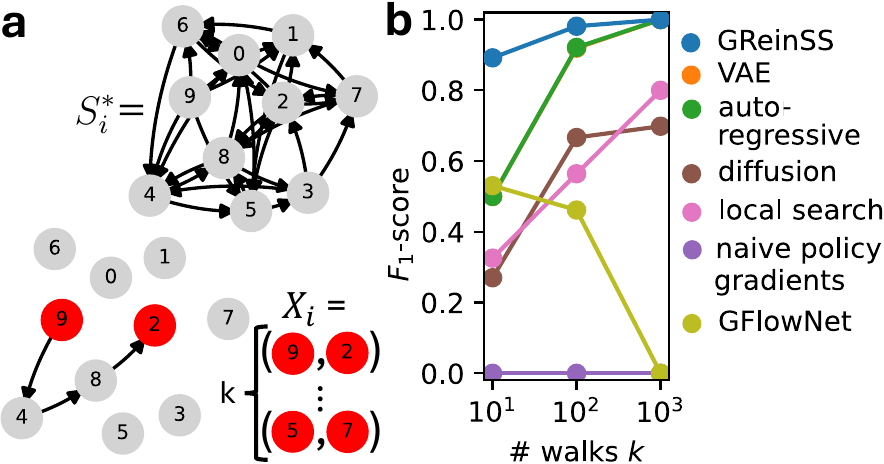
<span class="small">$k=10$ walks: GReinSS $F_1=\mathbf{0.891}$; all baselines $<0.55$</span>

</div>
<div class="center">

**Latent sets** from noisy measurements
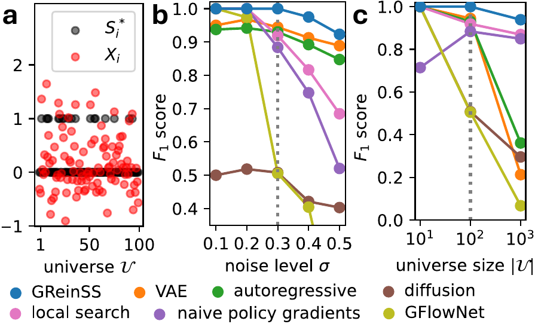
<span class="small">$|\mathcal U|=1000$: GReinSS $F_1=\mathbf{0.938}$; GEM baselines $<0.4$</span>

</div>
</div>

> Dynamic rewards are a **small** code change over naive PG — but decisive. Naive PG here predicts the **empty graph** ($F_1=0$).

<!--
Two combinatorial state types, same method. Left: graphs — GReinSS dominates especially
when observations are information-poor (few walks). Right: sets — GReinSS is the only method
that scales to large universes. GEM-based methods (VAE/autoregressive/diffusion) plateau;
the closest RL cousins (naive PG, GFlowNet) fail. The reward rescaling is the difference.
-->

---

<!-- _class: demo -->

## → NOTEBOOK · Demo 3: Graph inference (pre-trained)

<style scoped>
.cols { align-items: start; margin: 6px 0 0; }
.cartoon { margin: 0 auto; text-align: center; }
.cartoon img { width: 560px; max-width: 100%; height: auto; }
.ccap { font-size: 18px; color: var(--muted); text-align: center; margin: 2px auto 0; max-width: 960px; }
.ccap b { color: var(--ill-blue); font-weight: 700; }
</style>

Reconstruct latent **directed graphs** from start/end points of $k$ random walks. *Pre-trained.*

<div class="cols">
<div>

**Problem.** $S^*_i$ = directed graph (10 nodes, 90 edges); we see only the $(v,w)$ **endpoints** of $k$ absorbing walks. $\Pr(X\mid S)$: shifted-Laplacian $(L+I)^{-1}$.

**Shared structure:** Each $S^*_i$ = a random **thresholded subgraph** of one **Erdős–Rényi** $(p{=}\tfrac12)$ base graph.

</div>
<div>

**Watch for:**
- training likelihood curve (pre-computed)
- a reconstructed graph $\hat S_i$ vs. true $S^*_i$
- per-graph $F_1$ (median $\approx 0.97$)

</div>
</div>

<div class="cartoon">

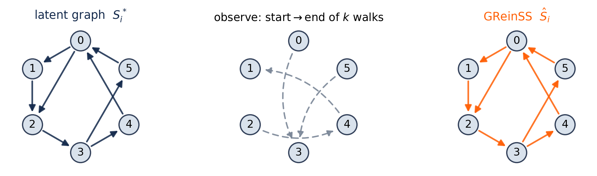

</div>

<div class="ccap">

<b><span style="color:#13294B">&#9679;</span> latent graph $S^*_i$</b> &nbsp; <b><span style="color:#FF5F05">&#9679;</span> GReinSS $\hat S_i$</b> &nbsp;—&nbsp; dashed = observed (start→end); paths never seen.
</div>

<!--
SWITCH TO JUPYTER (Demo 3). Heavier model, so we ship a pre-trained checkpoint.
Show: load model → simpleInference → compare predicted adjacency to the ground-truth graph
we saved during pre-training → report F1 and visualize one graph.
Ground-truth model: a single Erdős–Rényi base graph (edge prob 1/2), edge weights ~U(1/4,1);
each latent graph S*_i keeps the base edges whose weight exceeds a per-graph threshold ~U(0,1)
— so the N graphs share structure (the analog of the set "modules"). Observations = (start,end)
node pairs of k absorbing random walks; Pr(X|S) from the shifted-Laplacian (L+I)^{-1}. The
cartoon is a 6-node schematic; the real instance is 10 nodes / 90 possible directed edges.
-->

---

## Application — RNA isoforms beat RSEM

<div class="cols">
<div>

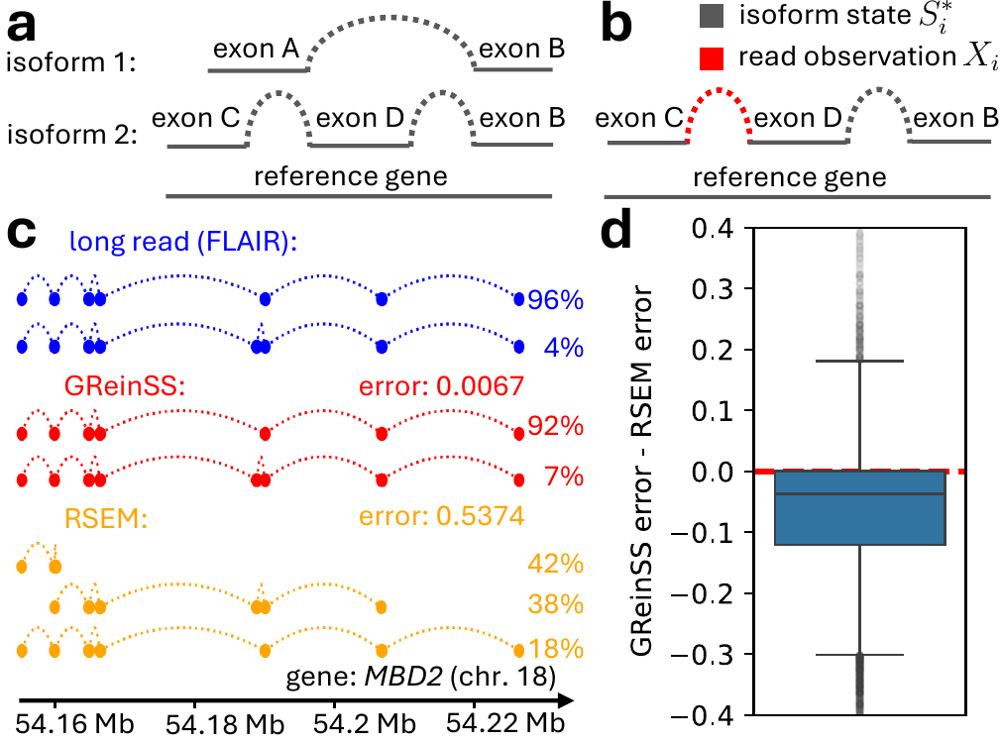

</div>
<div>

**State** $S$ = an isoform (chosen exon junctions) + sample + read position.
**$\Pr(X\mid S)=1$** iff read position & sample match — trivial forward model.

On **GTEx** (61 samples w/ matched long reads, 14,390 genes):

- GReinSS **beats RSEM by ≥0.05** on **46.6%** of genes; RSEM beats GReinSS on only **9.4%**
- *MBD2* example: GReinSS error **0.007** vs RSEM **0.537**

</div>
</div>

<!--
The payoff for this audience. Isoform quantification is a textbook latent-variable problem:
short reads are indirect observations of full-length transcripts. RSEM is the standard
EM tool GTEx ships. Dropping GReinSS in — with a trivial Pr(X|S) — matches long-read
ground truth far better. Panel c: on MBD2, GReinSS recovers the two true isoforms with
near-correct proportions; RSEM splits mass across wrong isoforms. Panel d: distribution
of (GReinSS - RSEM) error is shifted negative → GReinSS wins across the genome.
-->

---

## GReinSS already powers two cancer methods

<div class="cols">
<div class="box">

### CloMu
Tumor **phylogenies** of SNVs
*States:* mutation trees
*Observations:* noisy DNA-seq trees
<span class="small">Ivanovic & El-Kebir, RECOMB / Genome Res. 2023</span>

</div>
<div class="box">

### CNRein
**Copy-number** evolution in single cells
*States:* sets of CNA events per cell
*Observations:* single-cell DNA-seq
<span class="small">Ivanovic & El-Kebir, Genome Biol. 2025</span>

</div>
</div>

<br>

> This paper **generalizes** the shared technique behind both into one framework for *any* discrete latent structure — with theory, off-policy theory, and baselines.

<!--
GReinSS isn't just a new paper method — it's the generalization of machinery that already
produced two cancer-genomics tools. If you work on trees, CNAs, isoforms, or any grow-able
discrete structure with a known likelihood, this framework likely applies to you.
-->

---

## When should *you* reach for GReinSS?

<div class="cols">
<div>

**Good fit ✓**
- latent state is **discrete / combinatorial**
- you can **generate** it incrementally
- you know (or can compute) **$\Pr(X\mid S)$**
- observations are **indirect** & shared structure exists

</div>
<div>

**Reach elsewhere ✗**
- continuous latents → VAE / diffusion
- tractable exact E-step → classic EM
- rewards truly fixed & known → standard RL / GFlowNet

</div>
</div>

<div class="key">

**Recipe:** ① write a generator for $S$ · ② write $\Pr(X\mid S)$ · ③ `simpleTrainModel` · ④ `simpleInference`. *(optional)* add an off-policy proposal for hard instances.

</div>

<!--
Decision guide. The two hard requirements: an incremental generator and a likelihood.
If you have those, the four-line recipe is all you need to start — exactly what the
notebook demonstrates.
-->

---

<!-- _class: title -->
<!-- _paginate: false -->

# Thank you — let's build

**Code + notebook:** `code/README.md`, `tutorial/GReinSS_demo.ipynb`
**Recipe:** generator for $S$ + likelihood $\Pr(X\mid S)$ → train → infer

<br>

<span class="small">Questions? · melkebir@illinois.edu</span>

<!--
Wrap up: the method is one reward formula with a clean theorem, it beats the standard
tools on simulations and on real isoform data, and it's a drop-in for discrete latent-state
problems in cancer genomics. Open the notebook and try it on your own Pr(X|S).
-->
